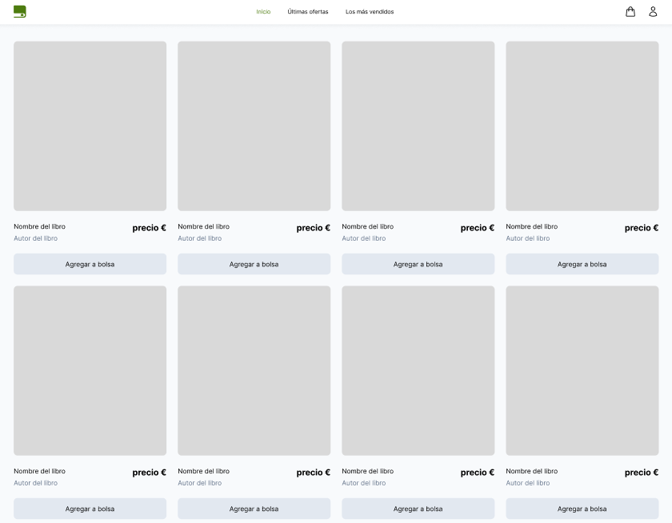
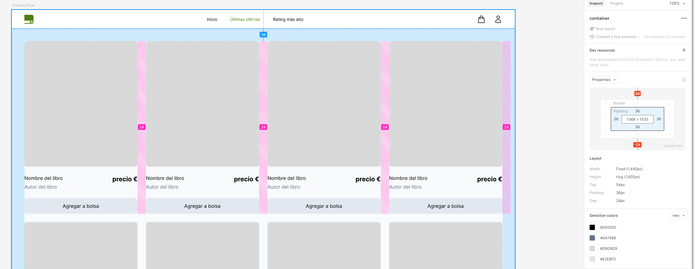

# Prueba Técnica: (Vue3 + TailwindCSS)

## Proyecto: "Refugio Literario" - Tienda Online de Libros



### Descripción del Proyecto

En esta prueba, desarrollarás una tienda online para la marca ficticia "Refugio Literario". El objetivo es mostrar una lista de libros y permitir a los usuarios añadirlos a un carrito de compras. Para esto, utilizarás **Vue3** y **TailwindCSS** como tecnologías principales.


### Prototipo de figma:

https://www.figma.com/proto/kuMhgK6er8CKiEoZDhlgSi/Prueba-t%C3%A9cnica-vue3-%2B-tailwindCSS?page-id=0%3A1&node-id=10-38&node-type=FRAME&viewport=812%2C477%2C0.27&t=n67GKMTCDlPmcO3A-1&scaling=min-zoom&content-scaling=fixed

### Tareas Principales

1. **Sección "Inicio"**
    - Mostrar todos los libros disponibles utilizando los datos proporcionados en un archivo JSON.
    - Usar el componente `LibroCard.vue` para mostrar la información de cada libro.
    - Implementar una grilla de libros de manera responsive usando TailwindCSS.

   

2. **Sección "Ofertas"**
    - Filtrar los libros que están en oferta y mostrarlos en una sección dedicada.
    - Reutilizar el componente `LibroCard.vue` con la información filtrada.

   

3. **Sistema de Carrito Básico**
    - Añadir la funcionalidad para que los usuarios puedan añadir libros al carrito desde cualquier sección, independientemente si está o no en stock. **El usuario solo podrá añadir un item por producto**.
    - Mostrar un botón en cada `LibroCard.vue` para añadir al carrito.
    - Gestionar el estado del carrito y visualizar los elementos añadidos.

4. **Sección "Carrito"**
    - Crear una vista adicional para mostrar los libros que el usuario ha añadido al carrito de compras.
    - Estilizar la vista para que sea clara y fácil de usar.

### Herramientas Disponibles

| **Herramienta**                | **Descripción**                                                                |
|--------------------------------|--------------------------------------------------------------------------------|
| **Vue3**                       | Framework de JavaScript para construir interfaces de usuario.                  |
| **TailwindCSS**                | Framework de CSS utilitario para aplicar estilos de manera rápida y eficiente. |
| **JSON de Libros**             | Archivo con los datos de los libros que se deben mostrar en la tienda.         |
| **Componente LibroCard.vue**   | Componente de Vue con estructura básica para mostrar un libro (sin lógica).    |
| **Pinia**                      | manejo avanzado de estados                                                     |
| **Composables**                | para lógica estática reutilizable                                              |
| **Breakpoints (TailwindCSS)**  | Clases utilitarias para estilos responsivos (`sm:`, `md:`, etc.).              |
| **@apply (TailwindCSS)**       | Directiva para limpiar y reutilizar clases CSS en los componentes.             |
| **Pseudoclases (TailwindCSS)** | Clases para añadir interactividad a los elementos (`hover:`, `focus:`, etc.).  |

#### Si tienes conocimientos sobre alguna directiva nativa de vue o directivas de tailwind, puedes usarlas como crear conveniente.

### Puntos a Evaluar

- **Implementación en Vue3:** Uso correcto de componentes, slots, y manejo de estado.
- **Estilización con TailwindCSS:** Aplicación eficiente y ordenada de clases utilitarias.
- **Organización del Código:** Modularidad y limpieza en la escritura del código.
- **Funcionalidad Extra (Plus):** Implementación de la sección "Carrito" como funcionalidad adicional.

## Instalación

Sigue estos pasos para configurar el proyecto **"Refugio Literario"** en tu entorno local:

### Prerrequisitos

- **Node.js** instalado (versión 14 o superior).
- **npm** instalado (generalmente viene con Node.js).
- **Git** instalado para clonar el repositorio.

### Pasos de Instalación

1. **Clona este repositorio en tu máquina local**

   ```bash
   git clone https://github.com/tu-usuario/refugio-literario.git

2. **Instala el proyecto**

   ```bash
   npm install

3. **Inicia el entorno de desarrollo**

   ```bash
   npm run dev